# Issues in DFC2023 Dataset Building Footprints

## Executive Summary

This document outlines notable issues discovered in the DFC2023 dataset that impact its reliability for benchmarking and evaluation. Based on comprehensive analysis of 1,773 samples:

1. **Widespread Zero-Height Building Footprints** (85.1% of images contain at least one)
2. **Mixed Building Footprint Quality across the dataset** (85.1% of images contain mixed footprint types)
3. **Rooftop vs. Building Base Footprints** (significant number of samples with incorrect footprint reference)

These issues affect a significant portion of the dataset and deserve attention from the DFC organizing committee.

## Note on Terminology

Throughout this document, we refer to different categories of building footprints:

- **Valid building footprints**: Building outlines with proper geometry and positive height values
- **Zero-height building footprints**: Building outlines that have been assigned a height value of zero
- **Invalid building footprints**: Building outlines with geometry that fails to meet standard GIS validity requirements
- **Mixed footprint types**: Images containing buildings from at least two different quality categories (valid, zero-height, or invalid)

Additionally, we use the term **polygon** to refer to the geometric shapes that make up building footprints. A single building footprint may consist of one or more polygons (for example, a building with a courtyard would have an outer polygon and an inner "hole" polygon).

## 1. Building Footprints with Zero Height

### Overview
Analysis reveals that 7.2% of building footprints have been assigned zero height in the DSM data, severely compromising height estimation tasks. More significantly, these zero-height buildings appear in 85.1% of all images in the dataset.

### Detailed Analysis
- **Total building footprints**: 125,153
- **Zero-height building footprints**: 9,063 (7.2% of all footprints)
- **Images containing zero-height buildings**: 1,509 (85.1% of all annotated images)

### Visual Observations
Visual examination shows that buildings with zero-height footprints frequently correspond to smaller structures compared to their surroundings in the RGB images. This pattern suggests that DSM data may have been created prior to RGB imagery acquisition, leading to temporal misalignment in the dataset.

## 2. Building Footprint Polygon Quality

### Overview
Analysis of the polygons that make up building footprints showed that there are no invalid building footprints in the dataset. What were previously identified as invalid geometries were actually in RLE (Run-Length Encoding) format that can be properly processed with specialized tools.

### Validation Summary
- **Total building footprints**: 125,153
- **Invalid building footprints**: 0 (0.0% of all footprints)
- **Images containing invalid building footprints**: 0 (0.0% of all annotated images)

### Criteria Used for Polygon Validation

The following criteria were used to identify invalid polygons in the dataset:

1. **Basic Polygon Structure**
   - Ensures segmentation data exists and is properly formatted
   - Checks if polygons have at least 3 points (`len(poly) >= 6` for flattened coordinates)

2. **Creation Validity**
   - Attempts to construct a valid Shapely Polygon object from the coordinates
   - If construction fails with an exception, the polygon is considered invalid

3. **Run-Length Encoding (RLE) Handling**
   - For footprints in RLE format, validates that the encoding can be properly decoded
   - Ensures the RLE sequence follows the expected pattern and can generate a valid binary mask

> **Note on Shapely's Validation:** Our validation approach intentionally avoids using Shapely's `is_valid()` method, as it implements very stringent geometric validity checks based on the OGC Simple Features specification. Using this method would likely overestimate the count of invalid polygons. There are cases where geometrically "invalid" polygons (according to strict OGC standards) can still be successfully plotted and used in many GIS applications. 
>
> This raises an interesting question: could such technically invalid but practically usable polygons pose challenges to the main purpose of the contest tasks? Since the primary focus of the DFC2023 challenge involves building height estimation and classification rather than strict geometric validation, polygons that render correctly but fail strict validity checks should arguably be considered valid for the contest purposes.

> **Important Note on Footprint Formats:** Our analysis revealed that all previously identified invalid geometries were actually in RLE (Run-Length Encoding) format that failed to render properly using standard Shapely package functions. Users of this dataset should be cautious about the different geometry types (polygon vs. RLE) present in the COCO format footprints. Missing this distinction might result in incorrectly tracking building footprints or generating inaccurate statistics. When working with this dataset, proper handling of both traditional polygon coordinates and RLE-encoded masks is essential for complete coverage of all building footprints.

### Difference Between Footprint and Polygon Counts

An important aspect of the dataset that may cause confusion is the difference between the number of building footprints and the number of polygons:

- **Total building footprints**: 125,153
- **Total polygons**: 125,774
- **Difference**: 621 additional polygons

This difference occurs because some building footprints contain multiple polygons. Common reasons include:

1. **Buildings with Courtyards**: A single building with an interior courtyard may be represented as two polygons - an outer boundary and an inner "hole" 
2. **Complex Building Structures**: Buildings with disconnected parts (e.g., connected by underground passages not visible in aerial imagery)
3. **Multi-part Buildings**: Campus-style building complexes may be annotated as a single entity with multiple polygon components

When working with this dataset, it's important to recognize that a single footprint ID may correspond to multiple polygon geometries that together represent one building entity.

## 3. Rooftop vs. Building Base Footprints

### Overview
Analysis suggests that a significant number of building footprints in the dataset represent building rooftops rather than building bases. This is particularly problematic for building height estimation tasks, which fundamentally require the building base as the reference point for accurate measurements.

### Impact on Height Estimation
When a building footprint represents a rooftop instead of the building base:
- Height values become unreliable as they no longer represent the true building height
- Any height estimation model trained on this data will learn incorrect patterns
- Evaluation metrics using these footprints would yield misleading performance indicators

### Detection Challenges
Unlike other issues in the dataset, detecting rooftop vs. base footprint problems:
- Requires visual inspection of each sample
- Cannot be reliably automated through geometry or attribute analysis
- Demands comparison between the footprint and the actual building appearance in imagery

## Visual Examples

Example images illustrating both footprint quality issues and rooftop vs. base misrepresentations are available in the `images` folder:

### Mixed Footprint Quality Examples

| Example 1: RLE format Missed | Example 1: RLE format Included |
|:----------------------------:|:------------------------------:|
| 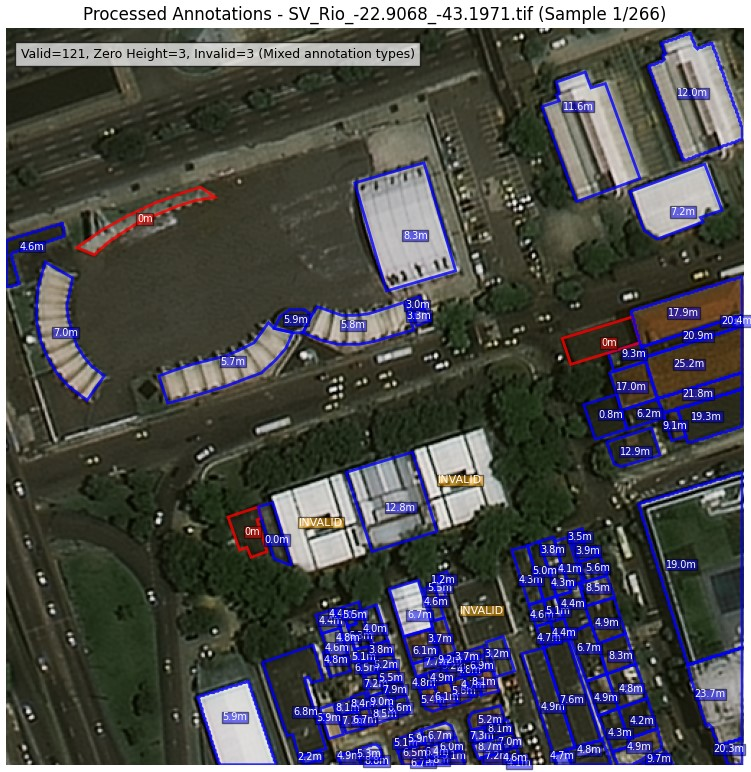 | 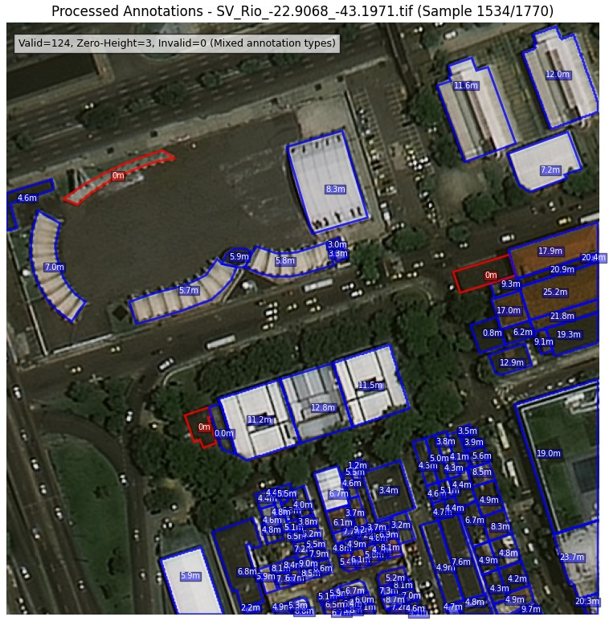 |

| Example 2: RLE format Missed | Example 2: RLE format Included |
|:----------------------------:|:------------------------------:|
| 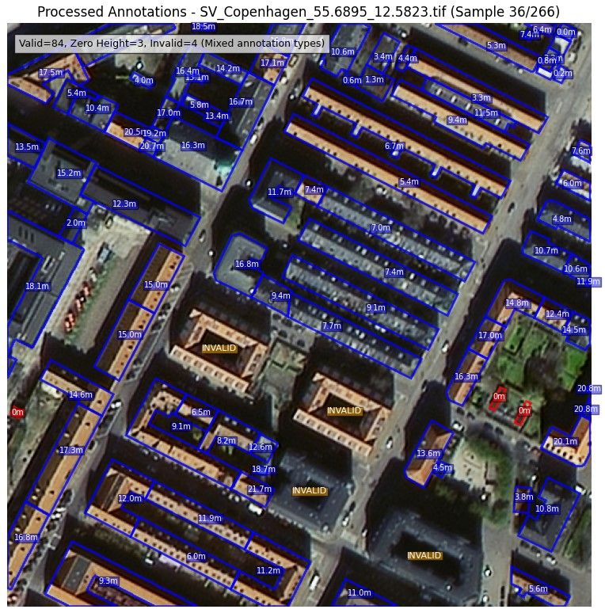 | 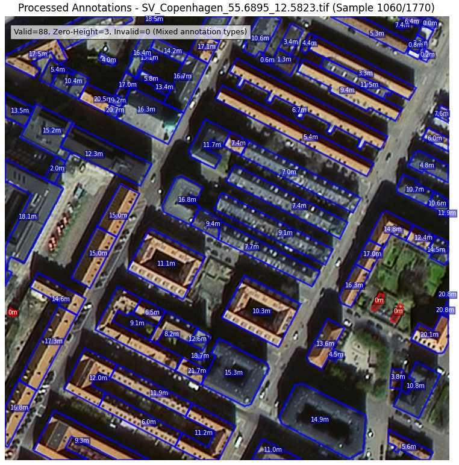 |

| Example 3: RLE format Missed | Example 3: RLE format Included |
|:----------------------------:|:------------------------------:|
| 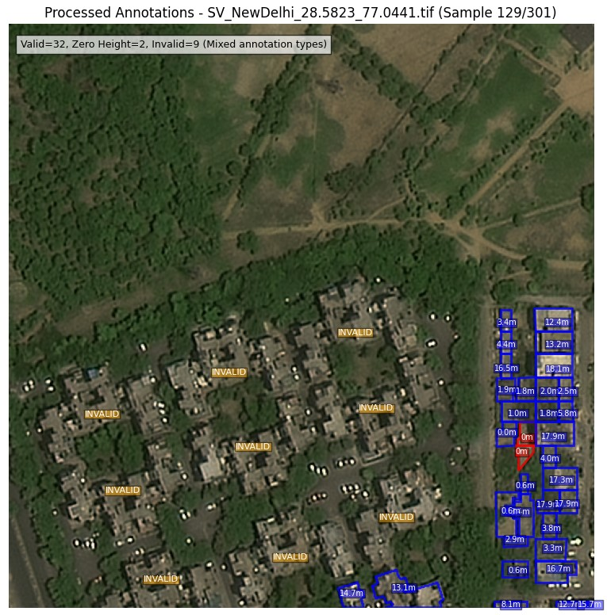 | 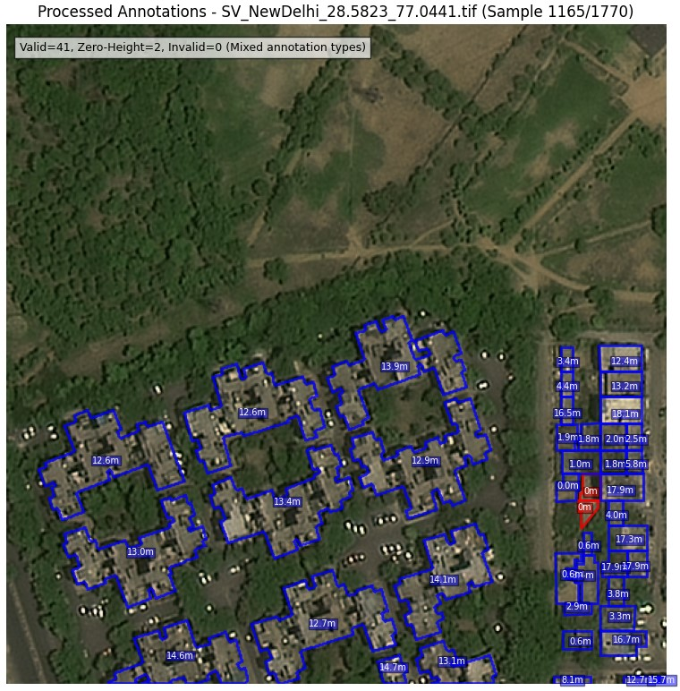 |

| Example 4: RLE format Missed | Example 4: RLE format Included |
|:----------------------------:|:------------------------------:|
| 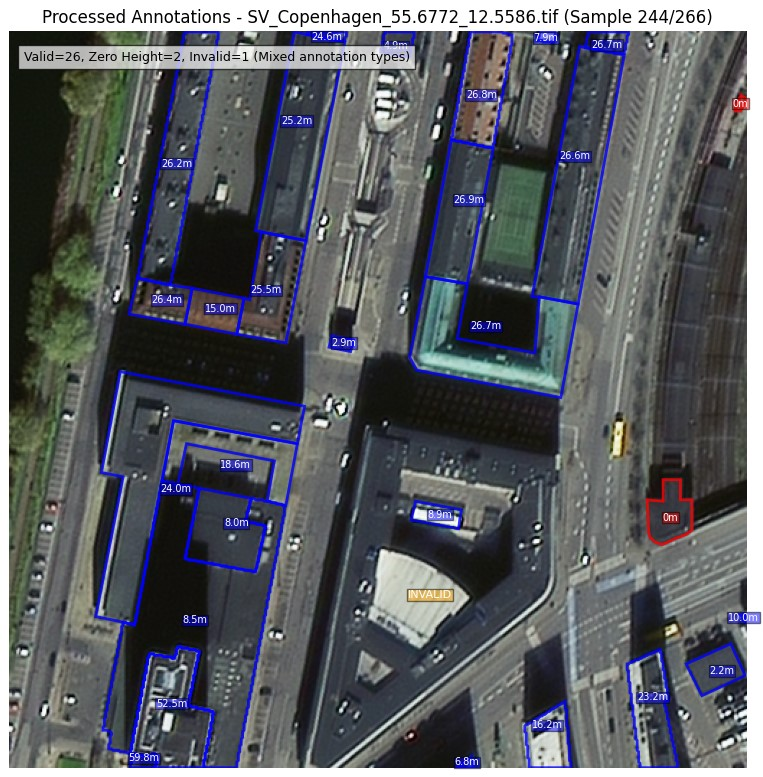 | 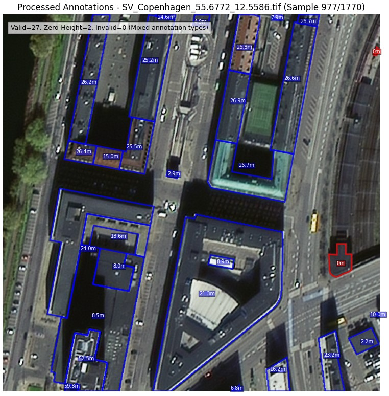 |

### Rooftop vs. Base Misrepresentation Examples

- 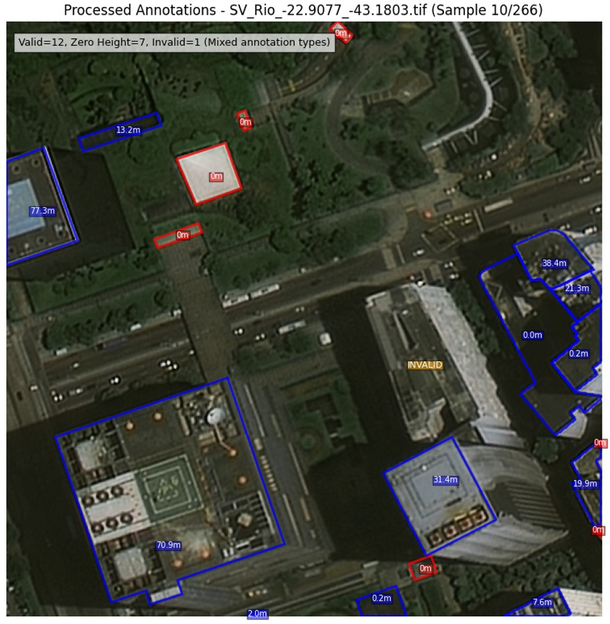
- 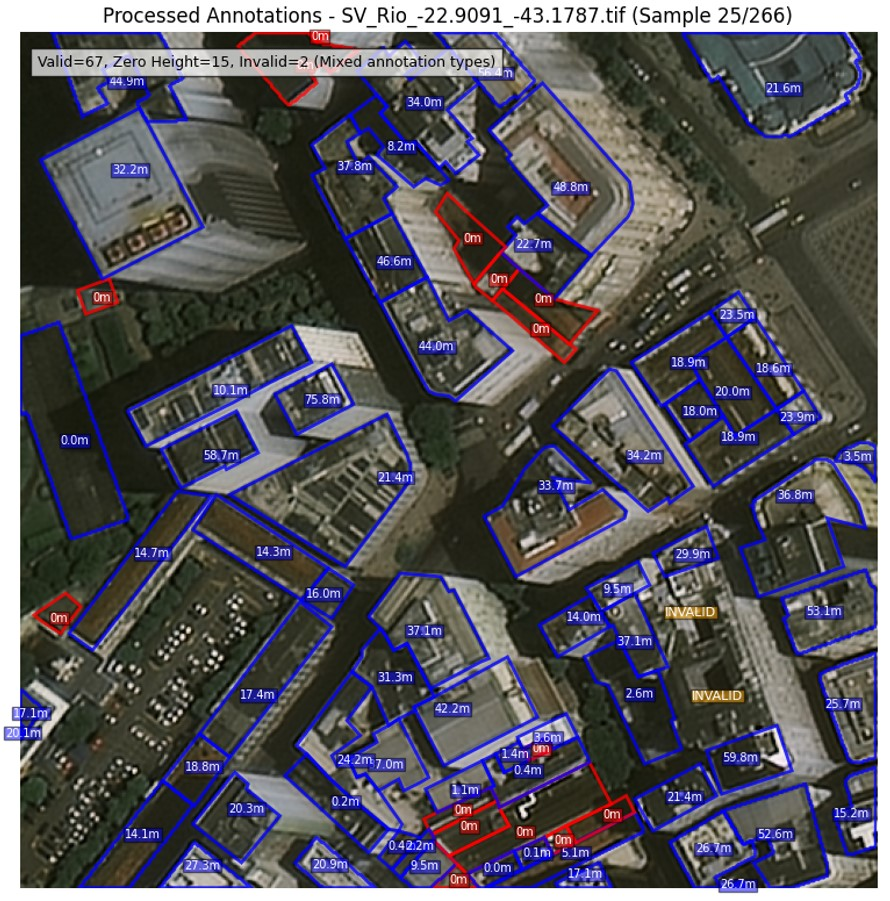
- 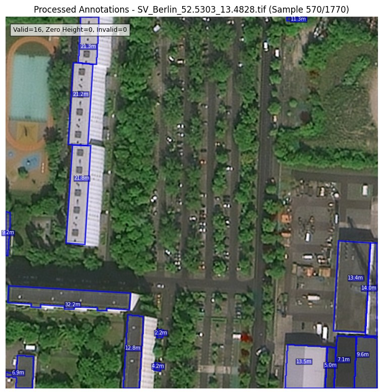
- 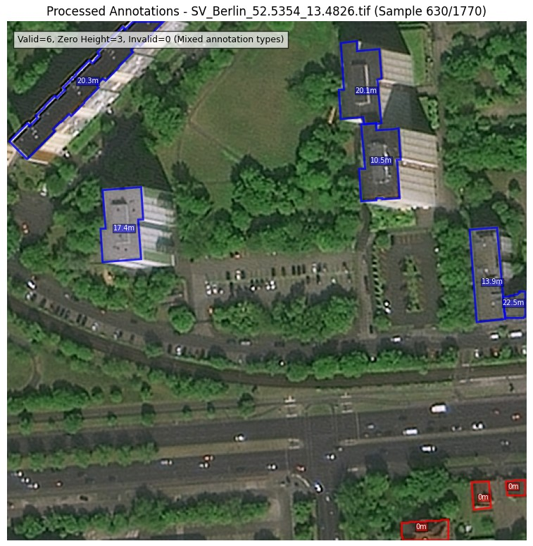

These visual examples clearly demonstrate the footprint issues described in this document and can be referenced when evaluating the dataset quality.

## Additional Dataset Statistics

Based on our comprehensive analysis:

- **Total samples**: 1,773
- **Total polygons**: 125,774
- **Total building footprints**: 125,153
- **Difference (polygons - footprints)**: 621
  (This difference occurs because some footprints contain multiple polygons)

### Sample Distribution:
- Images in COCO file: 1,773 (100.0%)
- Images with any footprints: 1,770 (99.8%)
- Images with valid buildings: 1,769 (99.8% of all images)
- Images with zero-height buildings: 1,509 (85.1% of all images)
- Images with invalid buildings: 0 (0.0% of all images)
- Images with mixed footprint types: 1,508 (85.1% of all images)
  *(Mixed footprint types refers to images containing buildings from at least 2 different quality categories - valid, zero-height, or invalid)*

### Building Footprint Distribution:
- Total building footprints: 125,153 (100.0%)
- Valid building footprints: 116,090 (92.8% of all footprints)
- Zero-height building footprints: 9,063 (7.2% of all footprints)
- Invalid building footprints: 0 (0.0% of all footprints)

## Recommendations for Action

We respectfully request that the DFC23 organizing committee consider the following actions:

### Regarding Building Footprint Corrections:
- Revisit the DSM data and update zero-height building footprints
- Ensure temporal consistency between DSM acquisition and RGB imagery
- Consider providing an updated version of the dataset with corrected height values

### Regarding Documentation:
- Share details about the DSM generation process to help users understand limitations
- Provide clarification on the temporal aspects of data collection
- Consider documenting known issues for the benefit of contest participants

## Conclusion

While the issue of invalid polygons does not specifically happen in this dataset, the zero-height building issue is pervasive, appearing in 85.1% of all images. This issue may impact the reliability of the DFC23 dataset for building height estimation tasks in particular.

We believe addressing these problems will enhance the value of this dataset as a benchmark for the remote sensing and geospatial analysis community.

Thank you for your attention to these matters.

## Working with the Dataset Tools

This repository includes tools to help analyze and visualize the DFC2023 dataset building footprints. These tools can help researchers understand the dataset's characteristics and issues.

### Prerequisites

- The DFC2023 training data, which includes:
  - RGB imagery (in `train/rgb/`)
  - DSM files (in `train/dsm/`)
  - Building footprints (`JSON/buildings_only_train.json`)
- Python environment with required dependencies: numpy, matplotlib, rasterio, shapely, PIL, tqdm, cv2, pycocotools (optional for improved RLE handling)

> **Note:** The training images are not included in this GitHub repository due to storage space limitations. You will need to download them separately from the original DFC2023 competition source: [IEEE GRSS Data Fusion Contest 2023](https://ieee-dataport.org/competitions/2023-ieee-grss-data-fusion-contest-large-scale-fine-grained-building-classification)

### Processing Building Footprints

The `process_annotations.py` script analyzes the original COCO building footprints and identifies valid buildings, zero-height buildings, and invalid building footprints.

**Usage:**

```bash
python process_annotations.py [--coco-path COCO_PATH] [--output-coco-path OUTPUT_PATH] [--dsm-folder DSM_FOLDER] [--quiet]
```

**Key functionality:**
- Validates both polygon and RLE segmentation formats in building footprints
- Calculates average height for each building using DSM data
- Classifies buildings into three categories: valid, zero-height, and invalid
- Generates an enhanced footprint file with added metadata
- Outputs comprehensive statistics about the dataset

All tools now use paths defined dynamically relative to the script location, making them fully portable across different environments. By default, the script reads from `JSON/buildings_only_train.json` and writes to `JSON/processed_annotations.json`.

> **Note:** The processed footprints file needs to be generated on your local machine by running the processing script. The file is not included in this GitHub repository due to its size.

### Visualizing Building Footprints

#### JSON Annotation Viewer
The `json_viewer.py` script provides a graphical interface for comparing original and processed building footprints, with proper handling of both polygon and RLE format annotations.

**Usage:**

```bash
python json_viewer.py [--original-coco-path ORIGINAL_PATH] [--processed-coco-path PROCESSED_PATH] [--rgb-folder RGB_FOLDER]
```

**Key functionality:**
- Side-by-side visualization of original and processed building footprints
- Support for both polygon and RLE format segmentations
- Color-coding of different footprint types (blue for valid, red for zero-height, orange for invalid)
- Filtering options to view specific subsets of images (e.g., only those with zero-height buildings)
- Toggle visibility of different footprint types
- Navigation controls (previous, next, random)
- Sample count information and detailed statistics
- Automatic logging of session activity for further analysis

Like the processing script, all visualization tools also use dynamic paths by default, making them portable across systems.

### Extracting Building Footprints

For users who need to extract building footprints as binary masks, the `building_footprint_extractor.ipynb` notebook provides a step-by-step approach to:

- Load COCO format annotations (both polygon and RLE formats)
- Process segmentations into binary masks
- Save the resulting building footprint masks to disk
- Generate detailed statistics about the dataset's building footprints

This notebook is especially useful for those preparing training data for segmentation models or performing additional spatial analysis.

### Workflow

1. First, process the original building footprints:
   ```bash
   python process_annotations.py
   ```

2. Then, view the processed footprints to analyze issues:
   ```bash
   python json_viewer.py
   ```

3. Use the viewer's filtering options to explore specific issues, such as viewing only images with mixed footprint types or zero-height buildings.

4. For more detailed extraction and analysis, use the `building_footprint_extractor.ipynb` notebook.

This workflow enables comprehensive analysis of the dataset footprint issues described in this document. All tools handle both polygon and RLE format segmentations correctly, ensuring complete coverage of all building footprints in the dataset.
